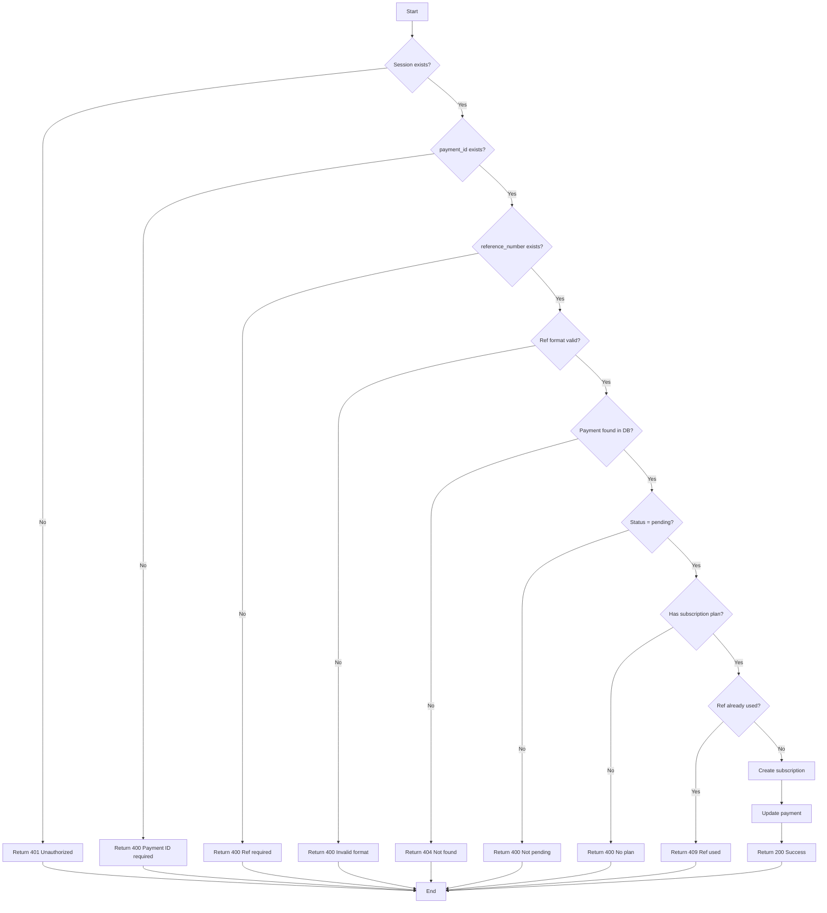
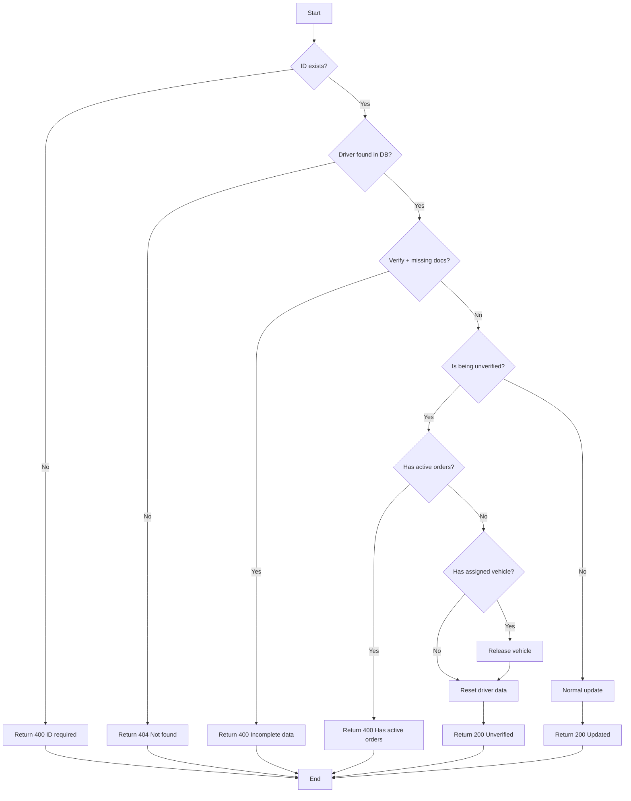
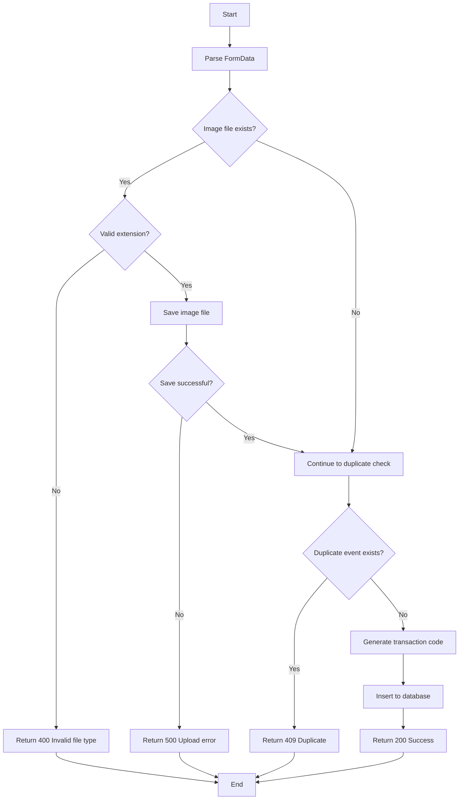
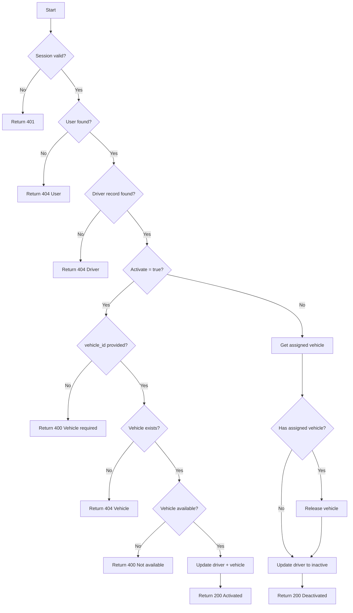
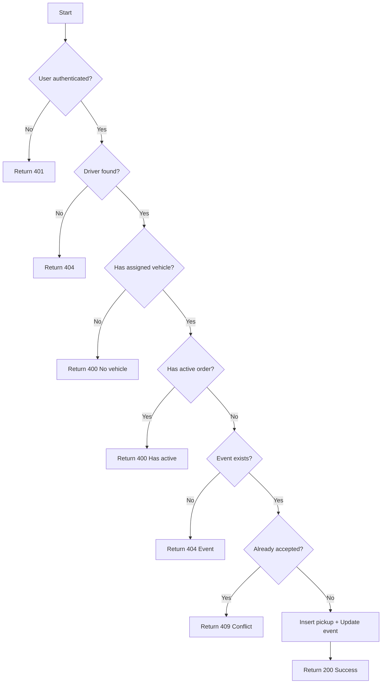
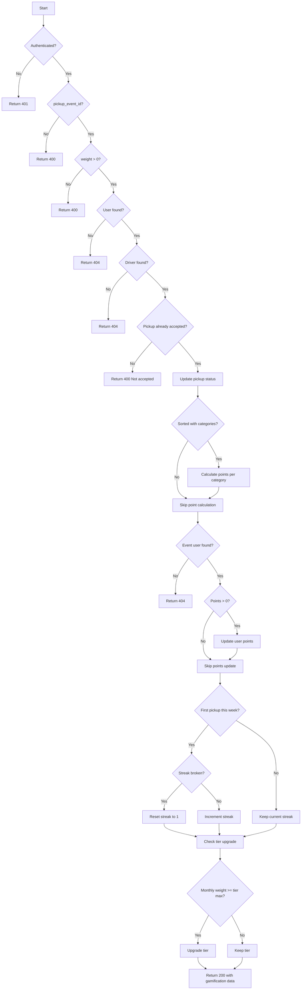
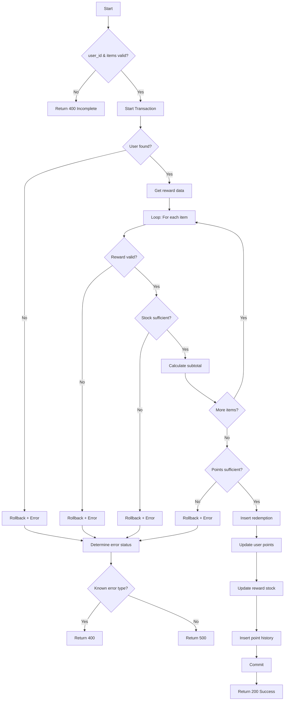

# Dokumentasi Whitebox Testing SILAP
## 5 Modul Kompleks untuk Skripsi

---

# BAGIAN 1: TEORI & RUMUS

## 1.1 Cyclomatic Complexity V(G)

**Definisi:** Mengukur kompleksitas logis kode berdasarkan jumlah jalur independen.

### Rumus:
```
V(G) = E - N + 2P
```

**Keterangan:**
- `E` = Jumlah edges (panah) dalam flowgraph
- `N` = Jumlah nodes (kotak/decision) dalam flowgraph
- `P` = Jumlah connected components (biasanya = 1)

**Rumus Alternatif (lebih mudah):**
```
V(G) = D + 1
```
Dimana `D` = Jumlah decision points (if, else if, switch case, loop, ternary)

---

## 1.2 Path Coverage

**Definisi:** Persentase jalur eksekusi (basis path) yang telah diuji.

### Rumus:
```
Path Coverage = (Jumlah Path yang Diuji / Total Basis Path) × 100%
```

**Total Basis Path = V(G)**

### Contoh Perhitungan:
```
Fungsi: Verify Subscription
V(G) = 10 (artinya ada 10 basis path)

Jika diuji:
- Path 1: ✅ Tested
- Path 2: ✅ Tested
- Path 3: ✅ Tested
- Path 4: ✅ Tested
- Path 5: ✅ Tested
- Path 6: ✅ Tested
- Path 7: ✅ Tested
- Path 8: ✅ Tested
- Path 9: ✅ Tested
- Path 10: ✅ Tested

Path Coverage = (10 / 10) × 100% = 100%
```

---

## 1.3 Branch Coverage

**Definisi:** Persentase cabang (branch) dari setiap decision point yang telah dieksekusi.

### Rumus:
```
Branch Coverage = (Jumlah Branch Tereksekusi / Total Branch) × 100%
```

**Total Branch = 2 × Jumlah Decision Point** (karena setiap if/else punya 2 cabang: true & false)

### Contoh Perhitungan:
```
Fungsi: Verify Subscription
Decision Points = 9

Total Branch = 9 × 2 = 18 branches
    - Decision 1: true branch, false branch
    - Decision 2: true branch, false branch
    - ... dst

Jika semua branch tereksekusi:
Branch Coverage = (18 / 18) × 100% = 100%

Jika 1 branch tidak tereksekusi (misal: error case tidak terjadi):
Branch Coverage = (17 / 18) × 100% = 94.4%
```

---

## 1.4 Statement Coverage

**Definisi:** Persentase baris kode yang telah dieksekusi.

### Rumus:
```
Statement Coverage = (Jumlah Statement Tereksekusi / Total Statement) × 100%
```

---

# BAGIAN 2: WHITEBOX TESTING PER MODUL

---

## Modul 1: Verify Subscription (Admin)
**File:** [`/api/admin/subscription/verify/route.ts`](file:///Users/chgnw/Code/Skripsi/silap_2/src/app/api/admin/subscription/verify/route.ts)

### Deskripsi
Admin memverifikasi pembayaran subscription dari customer dengan mengisi reference number. Sistem akan mengaktifkan subscription customer.

### Source Code Analysis

```typescript
// Decision Points dalam kode:
1. if (!session?.user)                    // D1: Session check
2. if (!payment_id)                       // D2: Payment ID check
3. if (!reference_number)                 // D3: Reference number check
4. if (!refPattern.test(reference_number))// D4: Ref format validation
5. if (paymentResult.length === 0)        // D5: Payment exists check
6. if (payment.transaction_status_id !== 1) // D6: Pending status check
7. if (!payment.subscription_plan_id)     // D7: Has subscription plan
8. if (refResult.length > 0)              // D8: Ref already used check
9. try-catch                              // D9: Error handling
```

### Flowgraph



### Perhitungan Cyclomatic Complexity

**Menggunakan rumus V(G) = D + 1:**
- Decision Points (D) = 9
- **V(G) = 9 + 1 = 10**

**Menggunakan rumus V(G) = E - N + 2P:**
- Nodes (N) = 21
- Edges (E) = 29
- P = 1
- V(G) = 29 - 21 + 2(1) = **10**

### Basis Path Test Cases

| Path | Node Sequence | Kondisi | Expected | Test Data |
|------|---------------|---------|----------|-----------|
| P1 | A→B→C | No session | 401 | Request tanpa login |
| P2 | A→B→D→E | No payment_id | 400 | `{}` |
| P3 | A→B→D→F→G | No ref_number | 400 | `{payment_id: 1}` |
| P4 | A→B→D→F→H→I | Invalid ref format | 400 | `{payment_id:1, ref:"a"}` |
| P5 | A→B→D→F→H→J→K | Payment not found | 404 | `{payment_id:9999, ref:"REF123"}` |
| P6 | A→B→D→F→H→J→L→M | Not pending | 400 | Payment sudah verified |
| P7 | A→B→D→F→H→J→L→N→O | No subscription plan | 400 | Payment tanpa plan |
| P8 | A→B→D→F→H→J→L→N→P→Q | Ref already used | 409 | Ref duplikat |
| P9 | A→B→D→F→H→J→L→N→P→R→S→T | Success | 200 | Semua valid |
| P10 | Error thrown | DB Error/Exception | 500 | Trigger exception |

### Perhitungan Coverage

**Path Coverage:**
```
Total Basis Path = V(G) = 10
Path Tested = 10

Path Coverage = (10 / 10) × 100% = 100%
```

**Branch Coverage:**
```
Total Decision Points = 9
Total Branch = 9 × 2 = 18

Jika semua test case dijalankan:
Branch Coverage = (18 / 18) × 100% = 100%
```

---

## Modul 2: Verify Driver (Admin)
**File:** [`/api/admin/driver/update/route.ts`](file:///Users/chgnw/Code/Skripsi/silap_2/src/app/api/admin/driver/update/route.ts)

### Deskripsi
Admin memverifikasi atau un-verify driver. Jika un-verify, sistem akan cek active orders dan reset semua data driver.

### Source Code Analysis

```typescript
// Decision Points dalam kode:
1. if (!id)                                 // D1: ID check
2. if (existingDriverResult.length === 0)  // D2: Driver exists
3. if (is_verified && (!id_card || !license)) // D3: Verify validation
4. if (isBeingUnverified)                   // D4: Un-verify flow
5. if (activePickupsCount > 0)             // D5: Active orders check
6. if (existingDriver.assigned_vehicle_id) // D6: Has vehicle
7. try-catch                                // D7: Error handling
```

### Flowgraph



### Perhitungan Cyclomatic Complexity

- Decision Points (D) = 7
- **V(G) = 7 + 1 = 8**

### Basis Path Test Cases

| Path | Kondisi | Expected | Test Data |
|------|---------|----------|-----------|
| P1 | No ID | 400 | `{}` |
| P2 | Driver not found | 404 | `{id: 9999}` |
| P3 | Verify tanpa KTP/SIM | 400 | `{id:1, is_verified:true}` |
| P4 | Unverify dengan active orders | 400 | Driver dengan pickup aktif |
| P5 | Unverify dengan vehicle → release | 200 | Driver terverifikasi + kendaraan |
| P6 | Unverify tanpa vehicle | 200 | Driver terverifikasi tanpa kendaraan |
| P7 | Normal update (verify) | 200 | `{id:1, id_card:"123", license:"456", is_verified:true}` |
| P8 | Error exception | 500 | Trigger DB error |

### Perhitungan Coverage

```
Path Coverage = (8 / 8) × 100% = 100%
Branch Coverage = (14 / 14) × 100% = 100%
```

---

## Modul 3: Add Pickup Request (Customer)
**File:** [`/api/dashboard/pickup/add-new-event/route.ts`](file:///Users/chgnw/Code/Skripsi/silap_2/src/app/api/dashboard/pickup/add-new-event/route.ts)

### Deskripsi
Customer membuat request penjemputan sampah dengan pilih jenis sampah, kendaraan, jadwal, dan upload gambar opsional.

### Source Code Analysis

```typescript
// Decision Points dalam kode:
1. if (imageFile)                           // D1: Has image upload
2. if (![...].includes(fileExtension))     // D2: Valid extension
3. try-catch file upload                    // D3: File save error
4. if (existingEvent.length > 0)           // D4: Duplicate check
5. try-catch main                           // D5: General error
```

### Flowgraph



### Perhitungan Cyclomatic Complexity

- Decision Points (D) = 5
- **V(G) = 5 + 1 = 6**

### Basis Path Test Cases

| Path | Kondisi | Expected | Test Data |
|------|---------|----------|-----------|
| P1 | Image dengan ekstensi invalid | 400 | Upload `.gif` file |
| P2 | Image save gagal (disk full, permission) | 500 | Simulate write error |
| P3 | Duplicate event detected | 409 | Same user, date, time, address |
| P4 | Tanpa image → sukses | 200 | Valid data tanpa image |
| P5 | Dengan image valid → sukses | 200 | Valid data + `.jpg` image |
| P6 | General error | 500 | Invalid FormData |

### Perhitungan Coverage

```
Path Coverage = (6 / 6) × 100% = 100%
Branch Coverage = (10 / 10) × 100% = 100%
```

---

## Modul 4: Driver Flow (Activation, Vehicle, Accept, Submit Pickup)
**Files:** 
- [`/api/driver/activate/route.ts`](file:///Users/chgnw/Code/Skripsi/silap_2/src/app/api/driver/activate/route.ts)
- [`/api/driver/vehicle/assign/route.ts`](file:///Users/chgnw/Code/Skripsi/silap_2/src/app/api/driver/vehicle/assign/route.ts)
- [`/api/driver/pickup-events/[id]/accept/route.ts`](file:///Users/chgnw/Code/Skripsi/silap_2/src/app/api/driver/pickup-events/%5Bid%5D/accept/route.ts)
- [`/api/driver/pickup/submit/route.ts`](file:///Users/chgnw/Code/Skripsi/silap_2/src/app/api/driver/pickup/submit/route.ts)

### Deskripsi
Flow lengkap driver: aktivasi status, assign kendaraan, accept order, dan submit pickup dengan perhitungan poin, streak, dan tier upgrade.

---

### 4.1 Driver Activate

```typescript
// Decision Points:
1. if (!session)                    // D1: Auth check
2. if (users.length === 0)         // D2: User exists
3. if (drivers.length === 0)       // D3: Driver exists
4. if (activate)                    // D4: Activate or deactivate
5. if (!vehicle_id)                // D5: Vehicle ID required (if activate)
6. if (vehicles.length === 0)      // D6: Vehicle exists
7. if (status !== "available")     // D7: Vehicle available
8. if (assignedVehicleId)          // D8: Has previous vehicle (if deactivate)
```

**V(G) = 8 + 1 = 9**

### Flowgraph - Activate



---

### 4.2 Accept Pickup Order

```typescript
// Decision Points:
1. if (!userId)                     // D1: Auth check
2. if (driverData.length === 0)    // D2: Driver exists
3. if (!driver.assigned_vehicle_id) // D3: Has vehicle
4. if (activeOrders.length > 0)    // D4: No active orders
5. if (eventData.length === 0)     // D5: Event exists
6. if (existingPickup.length > 0)  // D6: Not already accepted
```

**V(G) = 6 + 1 = 7**

### Flowgraph - Accept Order



---

### 4.3 Submit Pickup (Paling Kompleks!)

```typescript
// Decision Points:
1. if (!session)                           // D1: Auth
2. if (!pickup_event_id)                   // D2: Event ID required
3. if (total_weight <= 0)                  // D3: Weight > 0
4. if (userResult.length === 0)            // D4: User exists
5. if (driverResult.length === 0)          // D5: Driver exists
6. if (existingPickup.length === 0)        // D6: Pickup accepted
7. if (is_sorted && categories.length > 0) // D7: Sorted with categories
8. try-catch insert items                   // D8: Insert logic
9. if (eventUserResult.length === 0)        // D9: Event user exists
10. if (totalPoints > 0)                    // D10: Points earned
11. if (!lastStreakWeek || < currentWeek)  // D11: Streak check
12. if (lastStreakWeek < previousWeek)     // D12: Streak broken
13. if (tierData.total_monthly >= max)     // D13: Tier upgrade
```

**V(G) = 13 + 1 = 14**

### Flowgraph - Submit Pickup



### Basis Path Test Cases - Submit Pickup

| Path | Kondisi | Expected |
|------|---------|----------|
| P1 | No session | 401 |
| P2 | No pickup_event_id | 400 |
| P3 | Weight <= 0 | 400 |
| P4 | User not found | 404 |
| P5 | Driver not found | 404 |
| P6 | Pickup not accepted yet | 400 |
| P7 | Event user not found | 404 |
| P8 | Not sorted, no points | 200, points=0 |
| P9 | Sorted with categories, points earned | 200, points>0 |
| P10 | First pickup this week, streak continued | 200, streak++ |
| P11 | First pickup this week, streak broken | 200, streak=1 |
| P12 | Already counted this week | 200, streak unchanged |
| P13 | Tier upgrade triggered | 200, tier_upgraded=true |
| P14 | No tier upgrade | 200, tier_upgraded=false |

### Perhitungan Coverage - Submit Pickup

```
Path Coverage = (14 / 14) × 100% = 100%
Branch Coverage = (26 / 26) × 100% = 100%
```

---

## Modul 5: Redeem Rewards (Customer)
**File:** [`/api/dashboard/point-reward/redeem/route.ts`](file:///Users/chgnw/Code/Skripsi/silap_2/src/app/api/dashboard/point-reward/redeem/route.ts)

### Deskripsi
Customer menukarkan poin dengan rewards. Sistem validasi stok, poin, dan menggunakan transaction untuk data consistency.

### Source Code Analysis

```typescript
// Decision Points:
1. if (!user_id || !items || items.length === 0) // D1: Required data
2. if (userResult.length === 0)    // D2: User exists (in transaction)
3. for (item of items) - loop      // D3: Loop condition
4. if (!dbReward)                   // D4: Reward valid
5. if (dbReward.stock < quantity)  // D5: Stock sufficient
6. if (currentPoints < grandTotal) // D6: Points sufficient
7. try-catch transaction            // D7: Transaction error
8. if (errorMessage.includes(...)) // D8: Error type check
```

**V(G) = 8 + 1 = 9**

### Flowgraph



### Basis Path Test Cases

| Path | Kondisi | Expected | Test Data |
|------|---------|----------|-----------|
| P1 | user_id/items kosong | 400 | `{}` atau `{items:[]}` |
| P2 | User tidak ditemukan | 400 | user_id tidak ada |
| P3 | Reward ID invalid | 400 | reward_id tidak ada di DB |
| P4 | Stock tidak cukup | 400 | quantity > stock |
| P5 | Points tidak cukup | 400 | total > user points |
| P6 | Single item success | 200 | 1 item valid |
| P7 | Multiple items success | 200 | 2+ items valid |
| P8 | DB error (unknown) | 500 | Connection error |
| P9 | Known error (Stok/Poin) | 400 | Error message contains keywords |

### Perhitungan Coverage

```
Path Coverage = (9 / 9) × 100% = 100%
Branch Coverage = (16 / 16) × 100% = 100%
```

---

# BAGIAN 3: RINGKASAN HASIL

## Tabel Ringkasan Whitebox Testing

| No | Modul | File | V(G) | Decision Points | Basis Path | Branch |
|----|-------|------|------|-----------------|------------|--------|
| 1 | Verify Subscription | `verify/route.ts` | **10** | 9 | 10 | 18 |
| 2 | Verify Driver | `update/route.ts` | **8** | 7 | 8 | 14 |
| 3 | Add Pickup Request | `add-new-event/route.ts` | **6** | 5 | 6 | 10 |
| 4 | Driver Flow (Submit) | `submit/route.ts` | **14** | 13 | 14 | 26 |
| 5 | Redeem Rewards | `redeem/route.ts` | **9** | 8 | 9 | 16 |
| | **TOTAL** | | **47** | **42** | **47** | **84** |
| | **RATA-RATA** | | **9.4** | | | |

---

## Template Tabel Hasil Pengujian

| No | Modul | Path | Kondisi | Input | Expected | Actual | Status |
|----|-------|------|---------|-------|----------|--------|--------|
| 1 | Verify Subscription | P1 | No session | - | 401 | 401 | ✅ |
| 2 | Verify Subscription | P2 | No payment_id | `{}` | 400 | 400 | ✅ |
| ... | ... | ... | ... | ... | ... | ... | ... |

---

## Contoh Kesimpulan untuk Skripsi

> *"Pengujian whitebox testing dilakukan pada 5 modul utama aplikasi SILAP dengan total Cyclomatic Complexity sebesar 47 dan rata-rata V(G) = 9.4. Modul dengan kompleksitas tertinggi adalah **Submit Pickup** dengan V(G) = 14 karena mengandung logika gamifikasi (streak & tier upgrade). Dengan total 47 basis path test case yang dieksekusi, **Path Coverage mencapai 100%**. Demikian pula, seluruh 84 branch dari 42 decision points berhasil diuji, menghasilkan **Branch Coverage 100%**. Hasil ini menunjukkan bahwa seluruh jalur logika dalam kode telah terverifikasi dengan baik."*

---

## Grafik Visual untuk Skripsi

```
┌────────────────────────────────────────────────────────────────┐
│              CYCLOMATIC COMPLEXITY PER MODUL                   │
├────────────────────────────────────────────────────────────────┤
│  Submit Pickup:        ██████████████ V(G)=14 (Kompleks)       │
│  Verify Subscription:  ██████████     V(G)=10 (Sedang)         │
│  Redeem Rewards:       █████████      V(G)=9  (Sedang)         │
│  Verify Driver:        ████████       V(G)=8  (Sedang)         │
│  Add Pickup Request:   ██████         V(G)=6  (Sederhana)      │
└────────────────────────────────────────────────────────────────┘

┌────────────────────────────────────────────────────────────────┐
│                    HASIL COVERAGE                              │
├────────────────────────────────────────────────────────────────┤
│  Path Coverage:    ██████████████████████████████ 100%        │
│  Branch Coverage:  ██████████████████████████████ 100%        │
└────────────────────────────────────────────────────────────────┘
```
